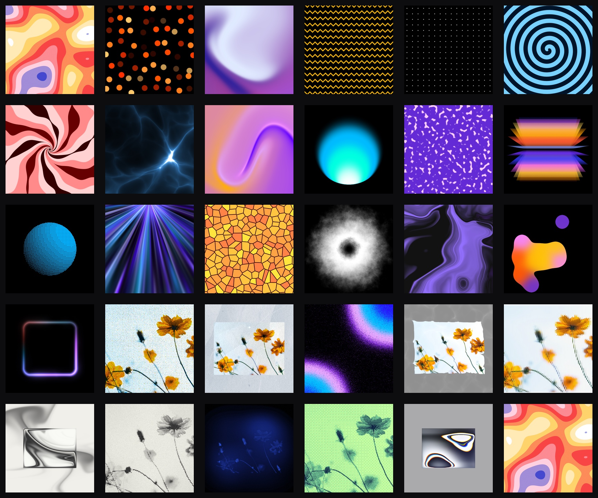

# Paper Shaders Flutter

Flutter runtime shader port of
[Paper Shaders](https://github.com/paper-design/shaders).



The package exposes all 29 upstream shaders as typed Flutter widgets and
catalogue entries. Each shader ships with upstream-aligned presets, deterministic
`frame` support, and the assets needed by noise and image-based effects. Shader
source, presets, noise textures, test images, and image-processing resources are
derived from the original Paper Shaders work.

## Install

```yaml
dependencies:
  paper_shaders: ^0.0.2
```

## Usage

Use the typed widget for a shader:

```dart
import 'package:paper_shaders/paper_shaders.dart';

class Background extends StatelessWidget {
  const Background({super.key});

  @override
  Widget build(BuildContext context) {
    return const SimplexNoiseView();
  }
}
```

Configure a shader with its typed params:

```dart
const MeshGradientView(
  params: MeshGradientParams(
    colors: <String>['#e0eaff', '#241d9a', '#f75092', '#9f50d3'],
    distortion: 0.8,
    swirl: 0.1,
    sizing: ShaderSizing.object(fit: ShaderFit.contain),
    speed: 1,
  ),
);
```

Or render from the catalogue:

```dart
final entry = ShaderCatalog.all.first;
final preset = entry.presets.first;

PaperShader(
  assetKey: entry.assetKey,
  uniforms: preset.uniforms,
  imageSamplers: entry.imageSamplers,
  sizing: preset.sizing,
  speed: preset.speed,
  frame: preset.frame,
);
```

Set `speed: 0` and pass a fixed `frame` for deterministic still renders and
golden tests.

## Coverage

- Shaders ported: 29/29
- Flutter presets covered by golden parity: 120/120
- Procedural, noise-texture, and image-based shader families are included.
- Known Flutter runtime differences are tracked in
  `doc/FLUTTER-GOLDEN-PARITY.md`.

Current shader catalogue:

`simplex-noise`, `dot-orbit`, `mesh-gradient`, `waves`, `pulsing-border`,
`halftone-cmyk`, `paper-texture`, `grain-gradient`, `gem-smoke`,
`halftone-dots`, `heatmap`, `image-dithering`, `liquid-metal`,
`color-panels`, `dithering`, `dot-grid`, `god-rays`, `metaballs`,
`neuro-noise`, `perlin-noise`, `smoke-ring`, `spiral`,
`static-mesh-gradient`, `static-radial-gradient`, `swirl`, `voronoi`, `warp`,
`water`, and `fluted-glass`.

## Example App

The `example` app is an interactive showcase for the full catalogue:

- responsive shader list with generated thumbnails;
- preset picker and live controls for sizing, motion and shader uniforms;
- color picker support in the example app only;
- fullscreen preview mode with an optional FPS HUD;
- code snippets that recreate the current preset in Dart;
- deterministic golden renderer mode used by `tool/check_flutter_parity.sh`.

The example FPS HUD measures Flutter frame cadence through a `Ticker`; it is
useful for interactive comparison, but it is not a GPU timer.

## Local Checks

```sh
flutter analyze
flutter test
cd example && flutter build macos --debug
cd example && flutter build ios --simulator --no-codesign
cd example && flutter build apk --debug
cd example && flutter build web
```

## Local Shader Compilation

Compile all currently catalogued shaders through Flutter's runtime shader path:

```sh
flutter test test/shader_compile_test.dart
```

## Local Golden Rendering

Render 512x512 PNGs for all currently catalogued presets through the macOS
example app:

```sh
tool/render_flutter_goldens.sh
```

Outputs are written to `build/flutter-goldens/`.

Compare those PNGs against the upstream WebGL goldens:

```sh
tool/check_flutter_parity.sh
```

Preset-specific tolerances are documented in
`doc/FLUTTER-GOLDEN-PARITY.md`.

Flutter test rendering uses `ps_pixelDerivative()` instead of GLSL `fwidth()`
because `flutter_tester` rejects `fwidth(float)` during SkSL generation. This is
a documented parity constraint for local goldens.

Uniform color arrays are still packed as `vec4[10]`, but shader reads use
constant-index helper functions because SkSL rejects dynamic uniform-array
indices in local tests.

## Publication Checks

Before publishing a release:

```sh
flutter pub publish --dry-run
dart pub global run pana . --no-warning
```

The package is expected to pass static analysis, compile every runtime shader,
and keep `pana` at the maximum pub points score.

## License

Apache 2.0 - see `LICENSE` and `NOTICE`. Derived from
[paper-design/shaders](https://github.com/paper-design/shaders).
